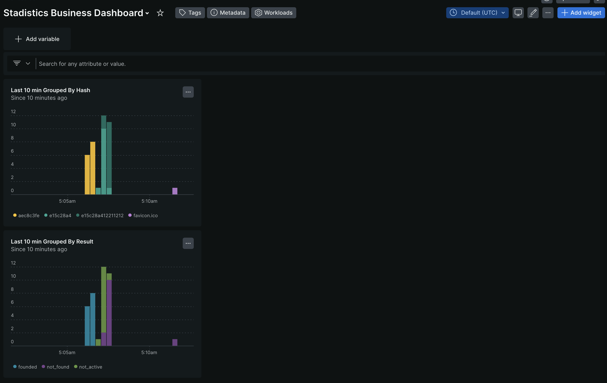

# Mercado Libre Shortener URL


## Tabla de contenidos
- [Requerimientos](#-requerimientos)
- [Diseño](#-diseño)
- [Local Build](#-build)
- [Escalabilidad](#-escalabilidad)
- [Monitoreo](#-monitoreo)
- [Postman collection](#pruebas)
- [Contacto](#-contacto)

## 🚀 Requerimientos

**Shortener URL** es una librería en Spring-boot para proveer una solución al desafío de MercadoLibre.

#### ⚙️ Requerimientos funcionales

- Generar URLS únicas cortas apartir de una URL mas larga
- Redireccionar al usuario a la URL original cuando se accede desde una url corta 
- Dar soporte al CRUD de la entidad generada
- Proveer analítica del sistema
- Seguridad utilizando links sobre https o http

#### 💼 Requerimientos no funcionales


- Alta disponibilidad de un **99.98%**
- Baja latencia generando url cortas y redireccionamiento, logrado en milisegundos
- Escalabilidad para un sistema que debe soportar millones de request al día

## 🎨 Diseño


- Application: Maneja las request para generar urls y redireccionar al usuario
- URL Generation Service: Servicio que genera urls evitando colisiones
- Redirect Service: Servicio que maneja los redirects utilizando caché para validar existencia
- Bloom Filter - Cache: Técnica elegida para demostrar conocimiento implementando este filtro, que presta ayuda en la validación de colisiones de hash y validación de existencia, esta técnica se utiliza en usos como generar urls cortas, seguridad (pishing, blacklists), hash maps.
- Database: Se utiliza una db no relacional Mongo DB
- Monitoreo: New Relic - Agent

### API

**Endpoint: POST /entry**
Este endpoint crea una nueva URL corta 

***Ejemplo request***
```json
{
  "url": "www.youtube.com"
}
```

***Ejemplo response***
```json
{
  "url": "https://www.youtube.com",
  "active": true,
  "short_url": "http://localhost:8080/82f08627"
}
```

> [!NOTE]  
> Por servicio gratis se utiliza http


**Endpoint: Get /{hash}**
Este endpoint redirecciona al usuario a la url original

***Ejemplo response***
```
HTTP/1.1 302 Redirect 
Location: url original
```

**Endpoints administrativos**

- DeleteEntry: elimina una entrada de URL
- PutEntry: actualiza los campos url y activo
- GetEntry(s): trae toda la lista de urls generadas


### Componentes claves

**Arquitectura Hexagonal vs Capas**

Se utiliza arquitectura hexagonal y se descarta en capas, debido a que la aplicación no aplica para ser pass through y necesita alta disponibilidad, prepara para escalar vertical y horizontal
Junto con eso se utilizan principios SOLID para implementar

**Generar URL**

Se asume que las colsiones pueden existir y se utiliza un filtro probabilistico para gestión y validación de hash. Se genera un arreglo de bytes que permite usando muy poco espacio y alta velocidad determinar la colisión; de esta manera se evita ir innecesariamente a la db.
Se utiliza método recursivo para la generación y validación del hash.

Se utiliza el algoritmo de [md5](https://www.avast.com/es-es/c-md5-hashing-algorithm) para generar hash de 8 chars alphanumerico, sobre 3.5 billones de hash únicos. 

[Bloom Filter ref](https://redis.io/docs/latest/develop/data-types/probabilistic/bloom-filter/)

> [!TIP]
> Para las colisiones se utiliza un algoritmo recursivo sobre el filtro Bloom para generar el hash 8 chars md5 


**Redirección**

Se intenta optimizar lo máximo posible utilizando el Filtro Bloom para validar existencia y dar respuesta rápida a los 404 sin necesidad de validar en la db.

La imagen a continuación es la evidencia de monitoreo que indica que el not found no llegó a la db para responder


Se utiliza una db no relacional MongoDB debido que esta optimizada para manejar registros clave:valor en alta disponibilidad y escalable, junto con eso se descarta el uso de Redis, debido a que se necesita persistencia para las métricas posibles.


La imagen a continuación es la evidencia de monitoreo que la redirección responde en pocos ms 40ms avg


**Expiración**

Los links tienen un atributo específico, si este esta en estado de `false` entrega un `404 not found`
Nota: este escenario si incluye una llamada a la base de datos

## 📝 Build

**Ambiente Local**

Para el ambiente de desarrollo contamos con las siguientes prerequisitos:
- Java 17
- Springboot 2.7
- Docker compose
  - Mongo db image
  - Mongo express monitor image

```shell
# Abre una terminal

# Clonar el repo
git clone git@github.com:luck-arancibia/shortener_back.git

# Montar la base de datos
docker-compose build
docker-compose up

# Como es mongo db, debemos crear una db y generar un registro
# Mongosh para conectar
mongosh localhost:27017 -u "root" -p "password" --authenticationDatabase "admin"

# Para ver la lista de db
show dbs;

# Crear db
use entries;

# Generar registro
db.entries.insert({"id": "123", "url": "https://google.com", "hash": "e3d336b3", "active": true})

# Compilar backend
./gradlew build

# Run
./gradlew bootRun

```
Validar visitando [swagger](http://localhost:8080/swagger-ui/index.html) 


**Ambiente Cloud** 

Para el ambiente Cloud (production) se usa un script de servicio linux para mantener el servicio corriendo `meliback.service`

> [!TIP]
> Se utiliza el 75% de los recursos del contenedor, porque se presume que java springboot es un servicio poco ligero

> Se agrega New Relic

```shell
# Comando usado en servicio
/usr/bin/java -jar -javaagent:/root/shortener_back/newrelic/newrelic.jar -Dnewrelic.environment=production -Dspring.profiles.active=production -XX:MaxRAMPercentage=75.0 -XX:MinRAMPercentage=75.0 -XX:InitialRAMPercentage=75.0 -jar -Dhttps.protocols=TLSv1.2 /root/shortener_back/build/libs/shortener-url-1.0.0.jar
```

Visitar [swagger cloud](http://144.126.213.134:8080/swagger-ui/index.html)

## 🧗 Escalabilidad

### Vertical

De acuerdo a los componentes de la solución, el escalamiento vertical se propone:
- Implementar load balancer
- Aumentar recursos del contenedor del Cloud & recursos de la db


### Horizontal
Para el  escalamiento horizontal se propone:
- Implementar load balancer
- Aumentar instancias dockerizadas del microservicio
- Aumentar instancias de la db

### Auto escalabilidad

De acuerdo a la implementación de bajo costo realizada, la mejor estrategia para que auto escale es la vertical en estos momentos.
Se podría usar componentes dockerizados y un servicio Cloud pagado para escalar verticalmente

### Cache

Al utilizar el filtro Bloom en memoria, se reduce la necesidad de ir a la DB en cada request
Pero sin duda se podrían implementar métodos tradicionales de cache como redis, springboot cache (para esta implementación en particular)

### Disponibilidad (Deseable)

#### Replicas
Se pueden implementar replicas de la db para mantener disponibilidad si algún nodo falla 

#### Failover
Se puede implementar mecanismo para que la api y la db apunten a los backups en caso de que los servidores principales presenten problemas


#### Zonas
Implementando el servicio en diferentes zonas se puede mejorar la latencia y mejorar la disponibilidad

## 🖥️ Monitoreo

Se utiliza [New Relic](https://newrelic.com/) para el monitoreo y dashboard de la solución

La imagen a continuación presenta evidencia de utilizar el dashboard de New Relic para obtener la cantidad de veces que se utilizo el hash `72dc5b79`


> [!TIP]
> De esta manera nos aprovechamos del system output del microservicio para ir a buscar esa información minimizando las interacciones con el microservicio

Se utuliza New Relic para obtener estadísticas
- Es posible trackear las urls y filtrar usando el panel query de New Relic
- Utilizando el `custom attribute` `hash` y `result` fue posible trackear las query de direcciones por `hash` y por resultados por registros no encontrados y registros inactivos
- Armando un dashboard es posible obtener información de Throughput, Tiempo de transacciones web, Apdex Score (satisfacción usuario), etc

La imagen a continuación presenta un dashboard básico de un servicio de New Relic conectado con el Agente & Java Agent
Las cuales permiten ver las estadísticas de:
* Count redirects by hash
* Count redirects by results
  * Not found 
  * Inactive
  * Founded




**Prueba de estrés**

Para la prueba de estrés se utiliza [Jmeter - Taurus](https://gettaurus.org/install/Installation/)
En este caso se utilizo OSX para desarrollar, por ende la instalación es:
- Instalar homebrew
  - `
/bin/bash -c “$(curl -fsSL https://raw.githubusercontent.com/Homebrew/install/HEAD/install.sh)”
`

- Instalar python3
  - `brew uninstall python@3.12`
- Instalar pip
  - `curl https://bootstrap.pypa.io/get-pip.py | python3`
- Instalar bzt
  - `pip3 install bzt`

Se considera que el servidor podría ser mejor, por ende se intenta con la prueba en Cloud del siguiente escenario
```yml
  - concurrency: 100
    ramp-up: 1m
    hold-for: 5m
```
Visitar el script `src/main/stress/taurus.yml` para modificar, apto para probar en la nube y en local


## Pruebas

Se adjunta colección de postman con dos ambientes: local & producción
Visitar la carpeta `extras/postman`

Se puede usar el swagger de los respectivos ambientes

Hay ejemplos de las respuestas en la lista de todos los registros y crear URL corta

[swagger local](http://localhost:8080/swagger-ui/index.html)

[swagger cloud](http://144.126.213.134:8080/swagger-ui/index.html)

> [!NOTE]  
> Se agrega un test en postman para guardar la url corta del servicio de crear URL
> De esa manera se visita el servicio de redirección y se prueba muy rápido la redirección

> Test guardado en Script Post New Entry 


## 🗨️ Contacto

#### Email
`luciano.arancibiav@gmail.com`

#### Github
`https://github.com/luck-arancibia/`

#### Linkedin
`https://www.linkedin.com/in/luciano-arancibia-599989101/`